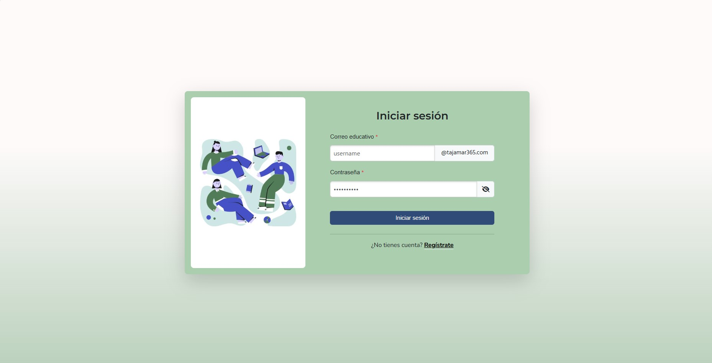
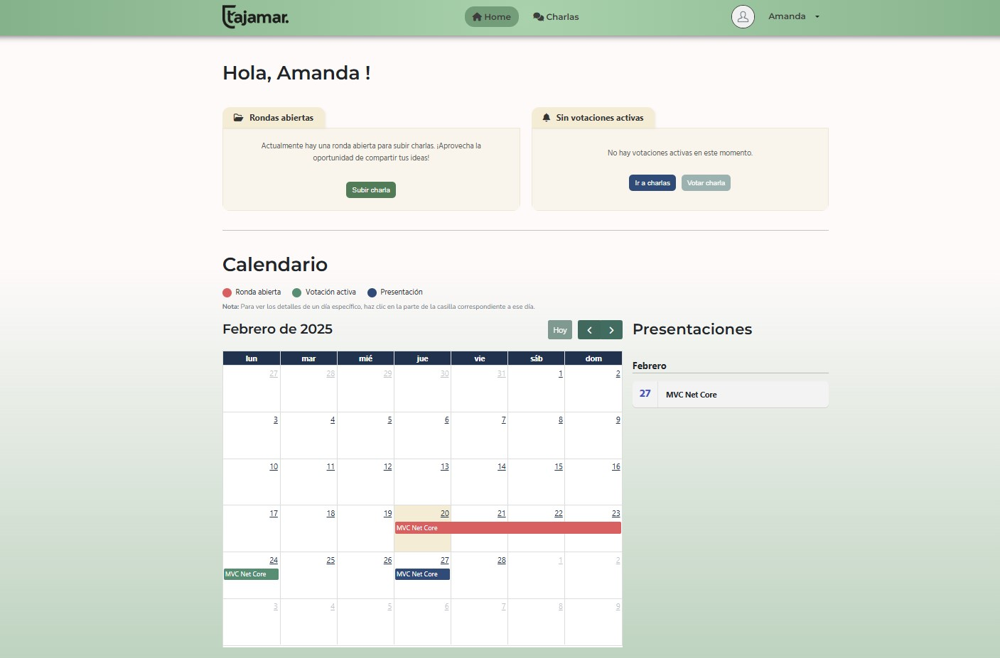

# Gestor de Charlas

Este proyecto fue desarrollado en equipo para gestionar charlas académicas. La aplicación permite a distintos tipos de usuarios administrar y visualizar charlas de forma eficiente.

## Tecnologías Utilizadas
- **Vue.js**: Framework principal para el desarrollo de la interfaz.
- **Bootstrap**: Librería de estilos para una interfaz responsiva y moderna.
- **FullCalendar**: Para la gestión visual de los eventos y charlas.
- **Chart.js**: Para la generación de estadísticas y gráficos interactivos.

## Perfiles de Usuario
El sistema maneja tres tipos de perfiles con diferentes niveles de acceso:

1. **Alumno**: Puede explorar las charlas disponibles y proponer sus propias charlas dentro de las rondas creadas por el profesor. También participa en la votación para decidir qué compañeros expondrán.
3. **Profesor**: Puede crear y gestionar rondas de charlas, y hacer un seguimiento del progreso de sus alumnos. Además, revisa las votaciones y selecciona las charlas mejor valoradas para su presentación.  
4. **Administrador**: Posee control total sobre la gestión de usuarios. 

## Capturas de Pantalla

## Contribuidores
Este proyecto ha sido desarrollado en equipo por:
- [Mario Jiménez Marset]([https://github.com/marsett])
- [Bárbara Jiménez Aguilar]([https://github.com/barjimen])
- [Sofía Martínez González]([https://github.com/SofiaMartinez23])

## Licencia
Este proyecto está bajo la licencia MIT.
